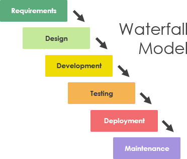

# Software Development Life Cycle Models

Abstraction of software development process with stages and order of process.

## Phases

### Requirements Gathering and Analysis

Understanding what the customer/user wants/needs from a business perspective.

After gathering all the requirements, an analysis is done to see how feasible the project is.

A Software Requirement Specification (SRS) document is the artefact after this phase.

### Design

Using the SRS document, a software architecture design is created.

### Implementation

Using the design document, source code can be written.

### Testing

After implementation is done, the software is tested to find any defects then fixed. Regression testing is necessary to
avoid any change in functionality while bugs are fixed.

### Deployment

The product is deployed to an environment that is a replica of the production environment for user acceptance testing.
Once the customer is satisfied, it can go to production.

### Maintenance

If any issues come up, they are taken care of by the team.

## Factors

- Project requirements (do requirements change? unclear?)
- Project size (big team?)
- Project complexity (Unclear requirements?)
- Cost of delay (timelines are flexible?)
- Customer involvement (consult with customer during process?)
- Familiarity with technology
- Project resources (funds, staff)

## Models

### Waterfall Model

Linear model of the Software Development Life Cycle (SDLC).

This model requires each phase to finish before starting the next, which is time-consuming, but each phase is clearly
defined.

Cannot be used in projects with unclear or changing requirements.

### Agile Model

Agile is an umbrella term that covers many methods. All of which have in common that the team needs to respond quickly
to changing demands. In agile model, the requirements are assumed to change, the customers are involved in each
iteration and documentation is written when needed.

#### Extreme Programming

XP has emphasis on:

- Pair programming
- Continuous process
- Coding standards
- Sustainable pace
- Test driven development

#### Scrum

Iterations are split into sprints, which are usually 2 to 4 weeks long. Scrum ceremonies include: sprint planning,
sprint review, sprint retrospective, daily scrum.

#### Kanban

The goal is to limit work in progress to maximize efficiency using a Kanban board.

### Iterative Model

The focus in this model is to build a small set of the requirements at a time. Doing so, it is easier to identify and
fix any functional or design flaw earlier. The overall project outline is implemented, then refined and improved
iteratively. If the large project can be broken down into components, this model may be applicable.

### Incremental Model

This model focuses on building small increments (features) of the project at time. One feature is built at a time
depending on the priorities. This model is good for projects with clear and complete defintion of the system before
starting.

### Spiral Model

Spiral model is a risk driven model, it tackles the highest-risk problem and does it in a cycle.

The number of cycles needed are unknown and there can be as many as needed.

This model is good for projects with unclear needs or projects that are still in the research and development phase.

For each of the cycles:

- Address the highest-risk problem and determine the objective and alternate solutions
- Evaluate the alternatives and identify the risks involved and possible solutions
- Develop a solution and verify if it’s acceptable
- Plan for the next cycle

### Rapid Prototyping Model

Prototypes require a lot less time to build and is extremely helpful to gather customer feedback in order to refine the
requirements. Many prototypes can be created until the customer is satisfied. This model increases the time to delivery,
but helps reduce the risk of missing feature or functionality or change in requirements during development.

### Build-and-fix Model

Neglects requirements gathering, specifications, design phases and testing. This is usually fine for small projects with
minimal complexity.

Becomes very hard to maintain in a large project as there is no documentation nor design document. The product will
usually be of lower quality.

### Unified Process

There are 4 main phases in the unified process that can happen concurrently (does not have to be sequential):

#### Inception

Communication and planning are the main activities during this phase. Customer requirements are identified. Use case
model, goal, plan are made.

#### Elaboration

Modeling is the main task in this phase. Development plan is created and the use case models, businesses cases and risks
are revised.

#### Construction

During this phase, the source code is written and the project is being implemented. Then testing happens.

#### Transition

The project is released to the public for beta testing. The project documentation is updated, user manuals are created.
The project is going into production. Defects that are identified are fixed.

